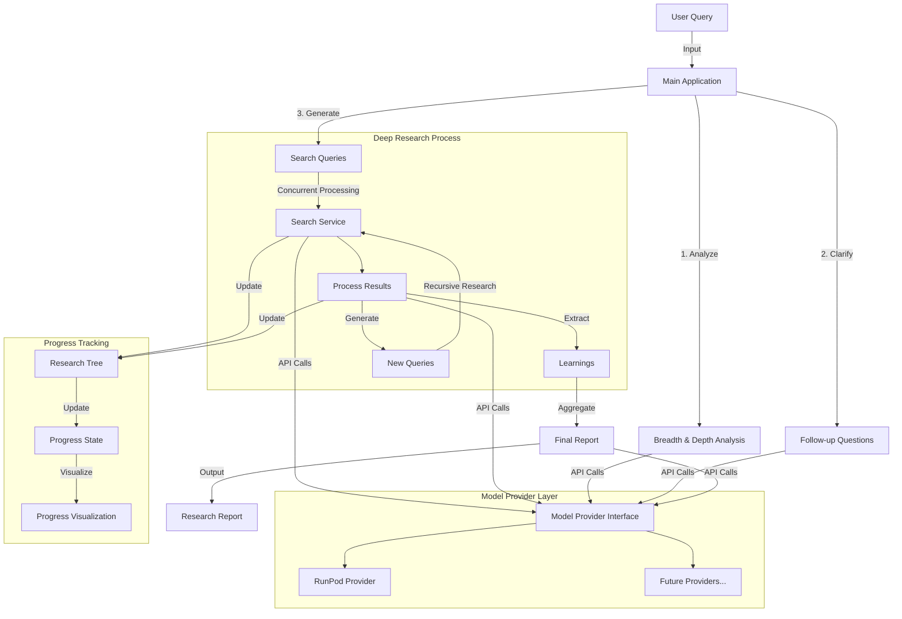
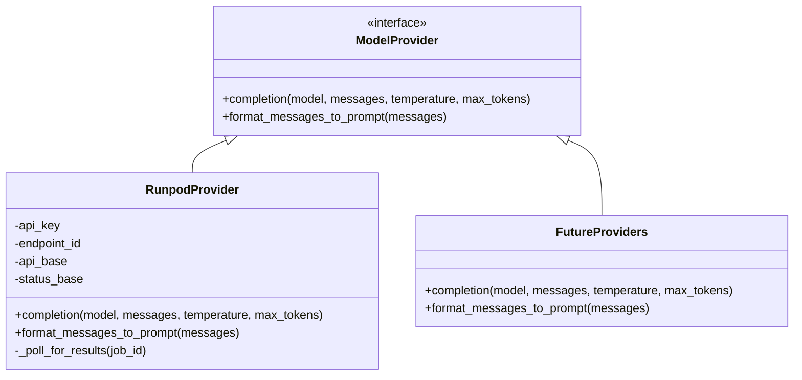
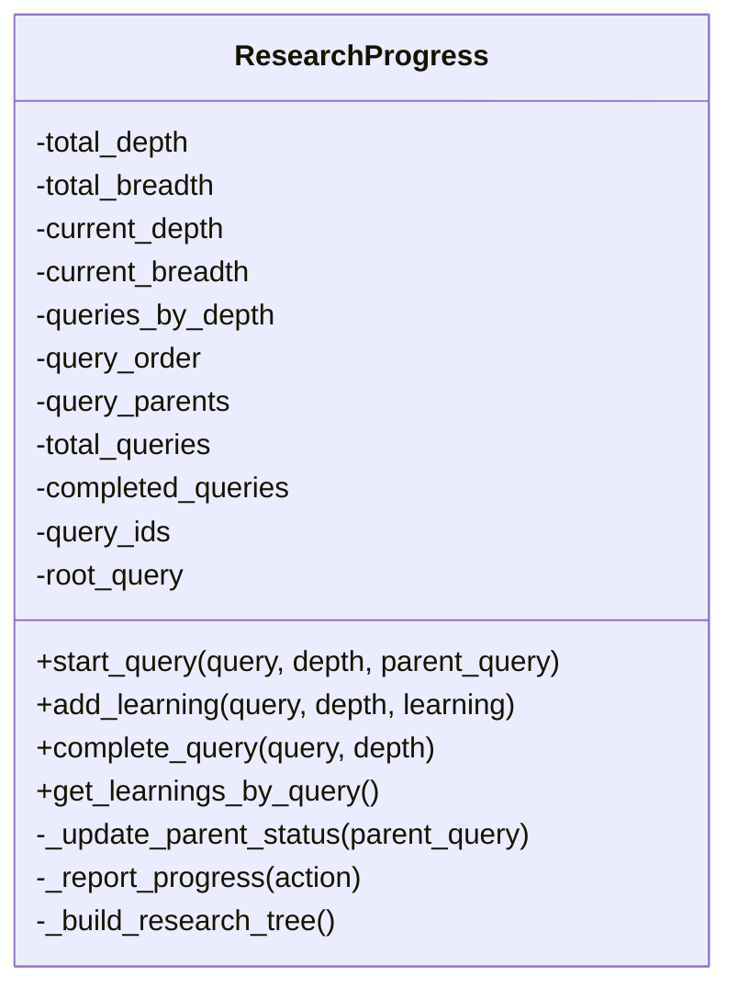
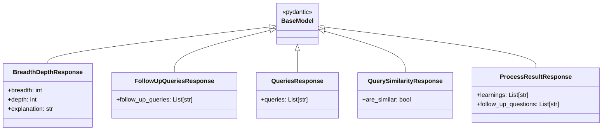
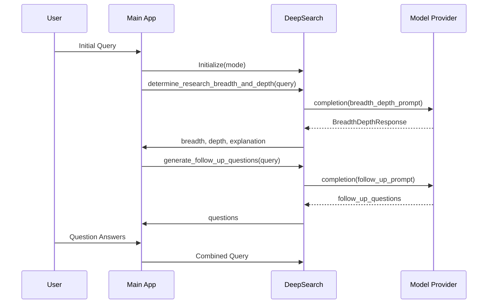
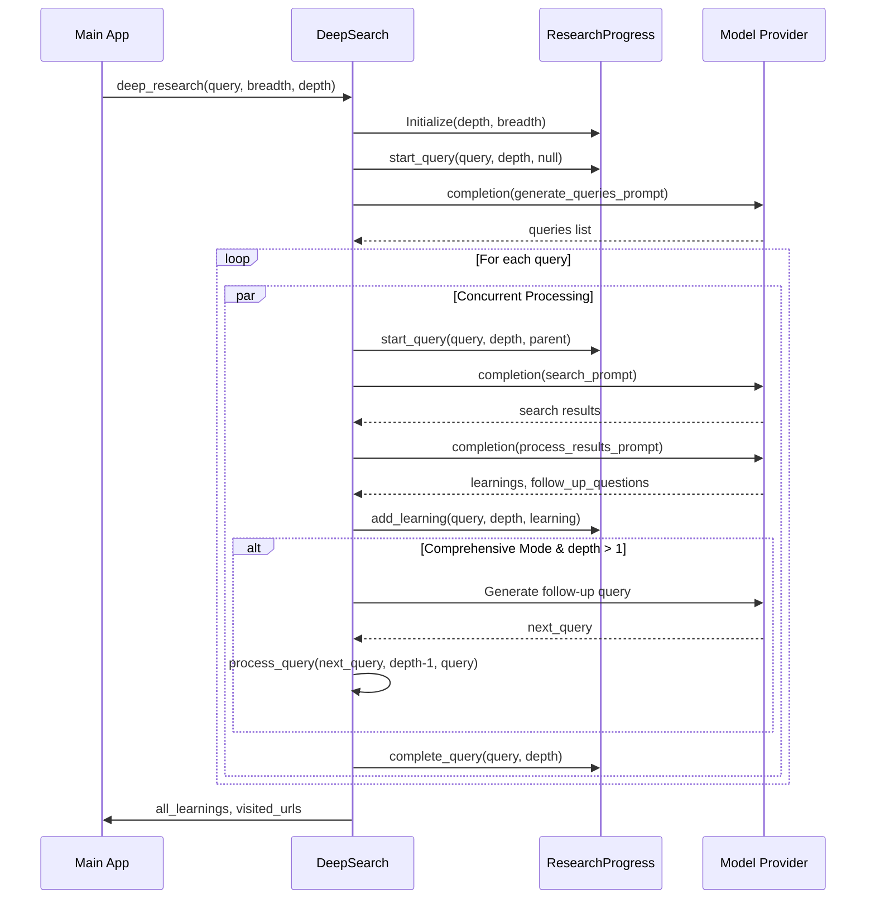
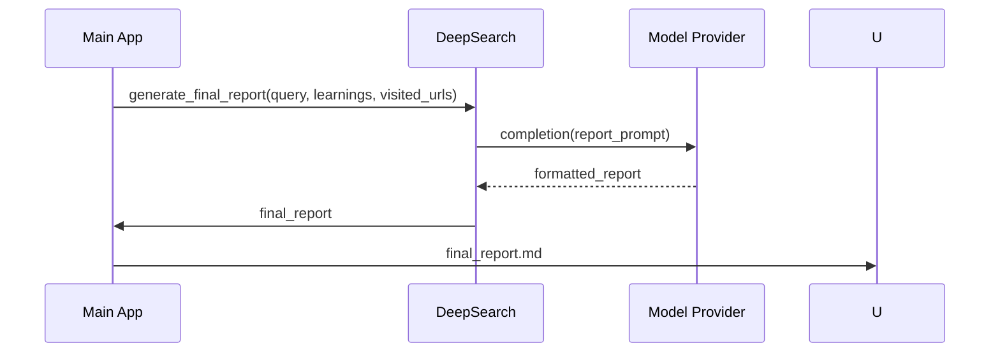
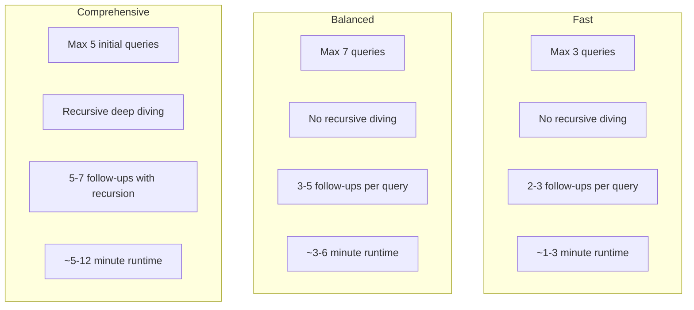
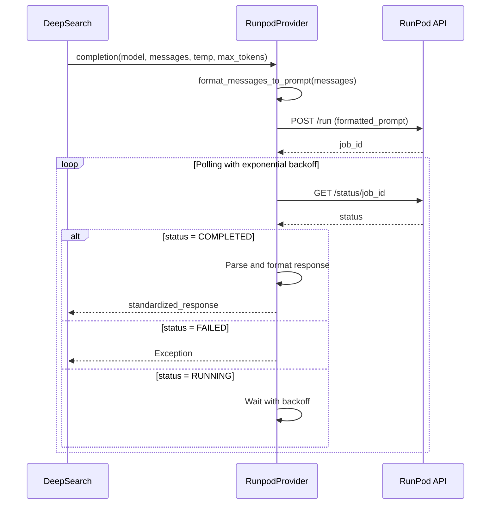
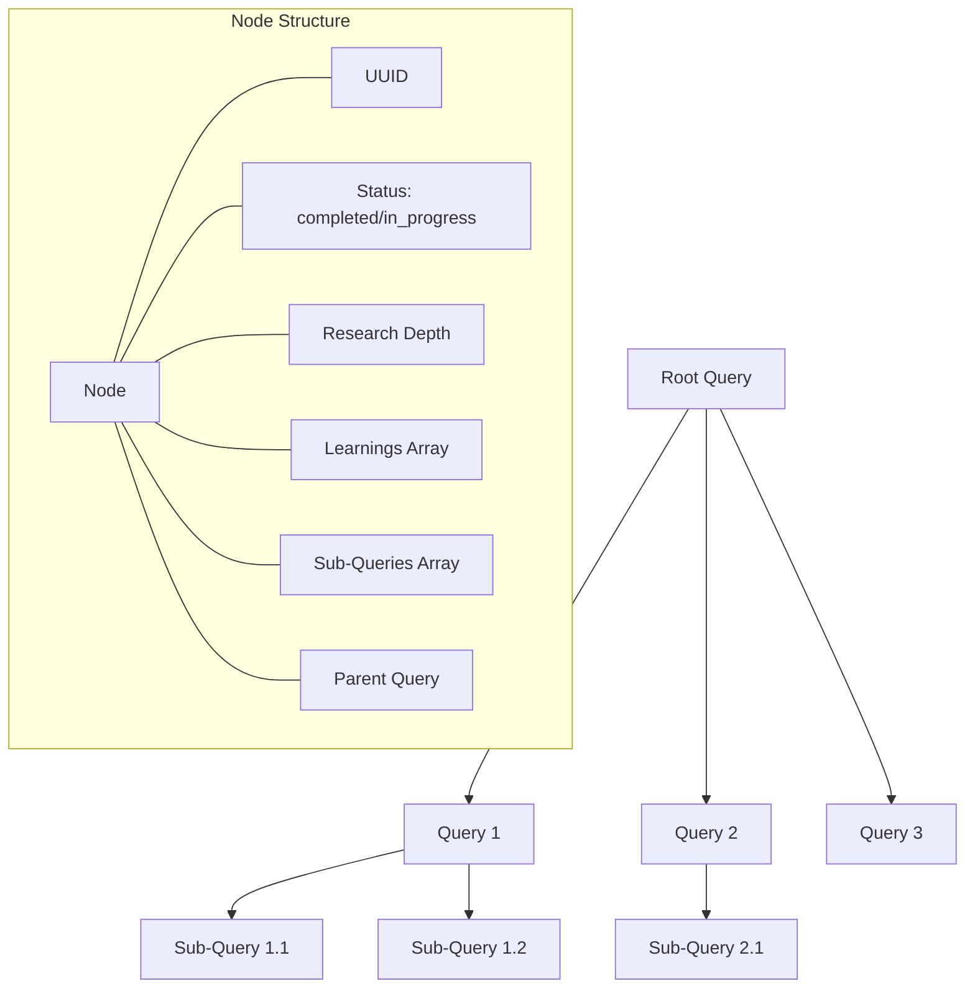

# Deep Research Flow: Architecture & Process

This document provides a detailed explanation of the Open Deep Research architecture, components, and workflow.

## System Architecture

## Component Breakdown

### 1. User Interface (Main Application)

The main application (`main.py`) serves as the entry point and provides:
- Command-line interface for accepting user queries
- Parameter configuration (mode, number of queries, etc.)
- Environment variable management
- Research orchestration

### 2. DeepSearch Engine

The `DeepSearch` class (`src/deep_research.py`) is the core engine that:
- Determines research scope (breadth and depth)
- Generates follow-up questions for clarification
- Creates search queries
- Manages the research process
- Generates the final report

### 3. Model Provider Layer

The Model Provider system (`src/models/`) provides a modular abstraction for different LLM backends:

#### RunPod Provider
The RunPod provider (`src/models/runpod_provider.py`) implements:
- REST API calls to RunPod
- Message formatting for Mistral
- Asynchronous job polling with exponential backoff
- Response parsing and standardization

### 4. Research Progress Tracking

The progress tracking system (`src/utils/research_progress.py`) maintains:

The research tree structure records:
- Parent-child relationships between queries
- Query status (completed/in-progress)
- Learnings associated with each query
- Research depth and breadth parameters
- Unique identifiers for each query

### 5. Response Models

Pydantic models (`src/utils/response_models.py`) ensure consistent data structures:

## Research Workflow

### 1. Query Analysis Phase

### 2. Research Execution Phase

### 3. Report Generation Phase

## Research Modes

The system supports three research modes that affect how deeply and broadly research is conducted:

### Mode Selection Impact

Each mode configures:
1. Maximum number of concurrent queries
2. Whether recursive deep diving is enabled
3. Number of follow-up questions generated
4. Runtime expectations

The comprehensive mode is particularly distinctive as it implements a tree-based research strategy where each query can spawn sub-queries that explore topics in greater depth.

## RunPod Integration

The RunPod integration handles:
1. Formatting messages for the Mistral model
2. Submitting jobs to the RunPod API
3. Polling for job completion with exponential backoff
4. Parsing and standardizing the response

## Research Tree Structure

The research progress is tracked using a tree structure:

Each node in the tree represents a research query with:
- Unique identifier
- Completion status
- Current depth level
- List of learnings
- References to parent and child queries

## Conclusion

The Open Deep Research system provides a modular, extensible framework for performing multi-layered research using LLMs. Its key strengths are:

1. **Modularity**: Easy to add new model providers
2. **Adaptability**: Configurable research modes for different needs
3. **Depth**: Recursive research capabilities for comprehensive analysis
4. **Tracking**: Detailed progress visualization and research tree
5. **Concurrency**: Efficient parallel processing of queries

This architecture allows the system to perform increasingly sophisticated research operations while maintaining a clear separation of concerns between components.